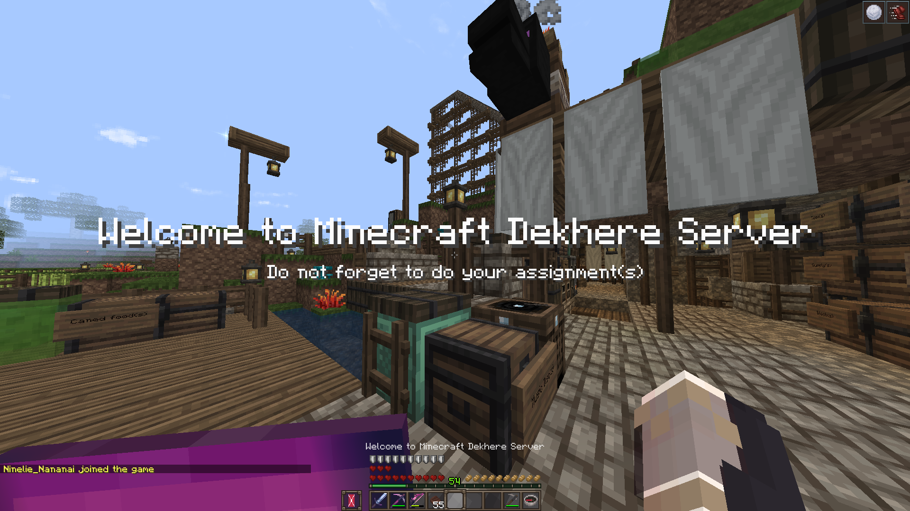

    

# Minecraft Dekhere Server by Nineria

Author: `Nineria` 

## Requirements
### Resource Pack
- Excalibur 1.18.1: [Download](https://www.mediafire.com/file/zin3cz824v8g55e/Excalibur_V1.18.1.zip/file
)

### Shader (Optional)
- OptiFine 1.18.2: [Download](http://adfoc.us/serve/sitelinks/?id=475250&url=http://optifine.net/adloadx?f=preview_OptiFine_1.18.2_HD_U_H6_pre1.jar&x=ec24)
- SEUS-Renewed: [Download](https://sonicether.com/shaders/download/renewed-v1-0-1/)

## How to play?
1. Install `Excalibur` Resource Packs
    - Download [Excalibur](https://www.mediafire.com/file/zin3cz824v8g55e/Excalibur_V1.18.1.zip/file
) ResourcePack File.
    - First Method (Recommended): Install Resource Packs while in game.
      - In game start menu
      - Click `Options...`.
      - Click `Resource Packs...`.
      - Click `Open Pack Folder`.
      - Copy `Excalibur_V1.18.1.zip` file and put it in the folder.
    - Second Method: Install Resource Packs in `AppData\Roaming\.minecraft`.
      - Go to `C:\Users\<username>\AppData\Roaming\.minecraft\resourcepacks`.
      - Copy `Excalibur_V1.18.1.zip` file and put it in the folder.

2. Install OptiFine 1.18.2 (Optional)
    - Download [OptiFine](http://adfoc.us/serve/sitelinks/?id=475250&url=http://optifine.net/adloadx?f=preview_OptiFine_1.18.2_HD_U_H6_pre1.jar&x=ec24)
    - Install OptiFine by double click on `OptiFine_1.18.2_HD_U_H6.jar`.
    - Click `Install` wait till finish and done.

3. Install `SEUS-Renewed` Shader (Optional)
    - Download [SEUS-Renewed](https://sonicether.com/shaders/download/renewed-v1-0-1/)
    - First Method (Recommended): Install Shader while in game
      - In game start menu
      - Click `Options...`
      - Click `Video Setting...`
      - Click `Shaders...`
      - Click `Shaders folder`
      - Copy `SEUS-Renewed-v1.0.1.zip` file and put it in the folder.
    - Second Method: Install Shader in `AppData\Roaming\.minecraft`.
      - Go to `C:\Users\<username>\AppData\Roaming\.minecraft\shaderpacks`.
      - Copy `SEUS-Renewed-v1.0.1.zip` file and put it in the folder.

## Install and setup Server
### How do i install minecraft server?
- search on the internet.

### Minecraft Server 1.18.2
- Download [minecraft_server.1.18.2.jar](https://launcher.mojang.com/v1/objects/c8f83c5655308435b3dcf03c06d9fe8740a77469/server.jar).

### Spigot 1.18.2
- Download [Spigot](https://download.getbukkit.org/spigot/spigot-1.18.2.jar).

### Plugin
- AureliumSkills-Beta1.2.10
- BetterSleeping
- ChestSort-13.0.2
- DeathDrops
- EliteMobs
- ExecutableItems-4.1.5.6
- GSit-1.0.7
- LevelledMobs-3.3.3_b604
- LPC
- LuckPerms-Bukkit-5.4.9
- OtherDrops3.2.6
- PlaceholderAPI-2.11.1
- ProtocolLib
- ServerListPlus-3.4.8-Universal
- SetHome-5.1.2
- SkinsRestorer
- TitleManager-2.3.6
- TreeCapitator-1.0-RELEASE
- worldedit-bukkit-7.2.9
- worldguard-bukkit-7.0.7-dist

## Command
1. Start Minecraft server:

        java -Xms2G -Xmx2G -jar .\spigot-1.18.2.jar nogui

2. Start `ngrok` server:

        ./ngrok tcp 25565 --region ap

## Server IP address and Port (Example)
 
    0.tcp.ap.ngrok.io:19688

